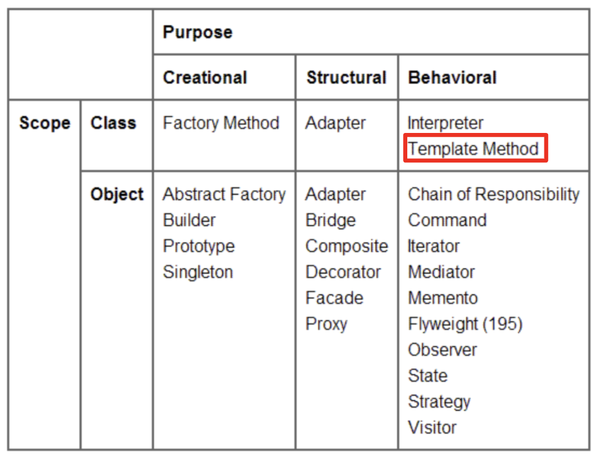
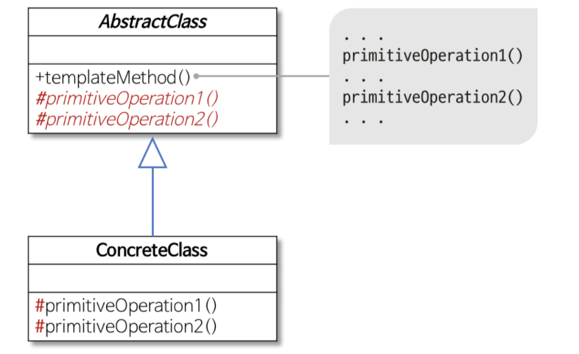
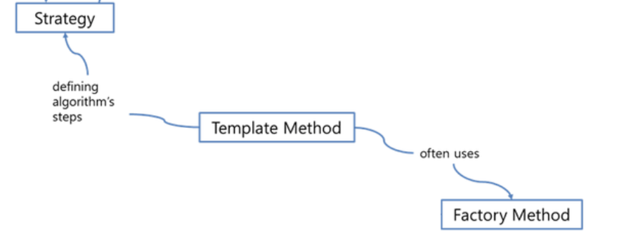

# TemplateMethod Pattern
## 행위(Behavioral) 패턴 
객체나 클래스 사이의 알고리즘이나 책임 분배에 관련된 패턴이다.
한 객체가 혼자 수행할 수 없는 작업을 여러 개의 객체로 어떻게 분배하는지, 
또 그렇게 하면서도 객체 사이의 결합도를 최소화하는 것에 중점을 둔다.

## 정의
알고리즘의 구조를 메소드에 정의하고, 하위 클래스에서 알고리즘 구조의 변경없이 알고리즘을 재정의 하는 패턴이다. 알고리즘이 단계별로 나누어 지거나, 같은 역할을 하는 메소드이지만 여러곳에서 다른형태로 사용이 필요한 경우 유용한 패턴이다.

## 구조

* Abstract Class
	* 알고리즘 처리 단계내의 기본 연산을 정의
	* templateMethod()에서 알고리즘 처리를 구현
	* 구현이 다양해질수 있는 부분을 추상메소드로 정의 ( primitiveOperation)
* Concrete Class
	* 서브클래스마다 달라진 알고리즘 처리 메소드 구현 ( primitiveOperation)

## 활용
* 어떤 한 **알고리즘을 이루는 부분 중 변하지 않는 부분**을 한번 정의해 놓고,**다양해질 수 있는 부분**은 서브클래스에서 정의할 수 있도록 남겨두고자 할때
* 서브클래스 사이의**공통적인 행동을 추출**하여, **하나의 공통 클래스**에 몰아둠으로써, **코드중복을 피하고**싶을 때

## *비슷한 패턴 비교*
* Template Method 패턴
	* 알고리즘의 **일부 단계**를 구현하는 것을 서브클래스로 위임
* Factory Method 패턴
	* 어떤 클래스를 생성할지 ( 알고리즘의 단계중 ) 서브클래스로 위임 
	* 특화된 Template Method 패턴이라고 할 수도 있다.
* Strategy 패턴
	* 변경할수있는 행동을 캡슐화하고, 어떤 행동을 할지는 서브클래스에게 위임

* Template Method  VS Strategy
	* 두 패턴 모두, 알고리즘을 **캡슐화**하는 패턴이다. ( Template Method - **상속** , Strategy - **객체 구성** )
	* Strategy 패턴은, 상속이 아닌 객체 구성을 이용하여 위임하여, 좀더 유연하다.
	* TemplateMethod 패턴은, 중복된 코드를 제거할수있다.

- - - -
