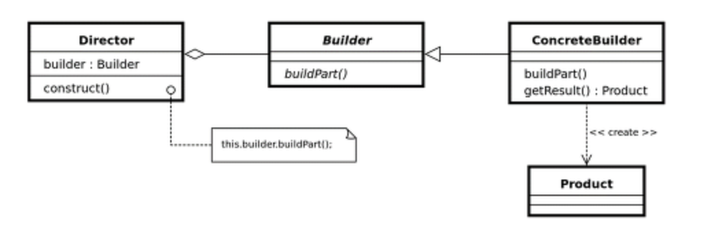
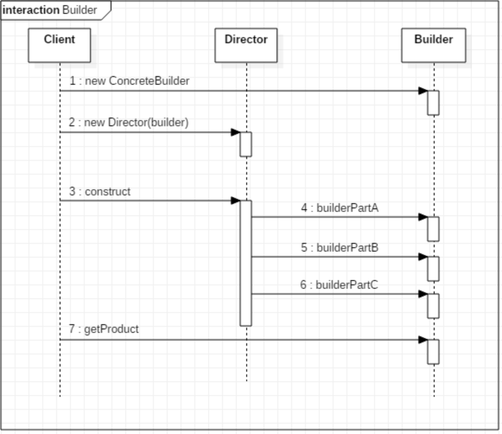

# Builder Pattern
### 정의
* 생성 패턴( Creational Pattern ) 중 하나로 객체의 생성 알고리즘과 조립방법을 분리하는것이 목적이다.
* 복잡한 객체를 생성하는 방법과 표현하는 방법을 정의하는 클래스를 별도로 분리하여,  동일한 생성 절차에서 서로 다른 표현결과를 만들 수 있게 하는 패턴이다.
* 빌더 패턴의 핵심은 객체를 생성 방식과 객체를 표현 방식을 분리하여, 다양한 생성 절차에서  서로 다른 표현 결과(객체)를 만들수 있게 하여, 객체 생성에 대한 부분을 유연하게 구현할 수 있다.

### 구조

Director는  Builder 인터페이스를 활용해서, 특정 복합 객체를 생성한다.
Director는 객체를 생성하는 절차를 구현하고 
이 절차로 부터 요청을 받아서, 생성할 객체를 만드는 책임은 
Builder 인터페이스를 구현하는 ConcreateBuilder에게 위임한다.
(ConcreateBuilder 클래스들은 복잡한 객체를 생성하고, 조립하는데 필요한 매커니즘을 Builder 인터페이스에 정의된 각 연산으로 구현.)

빌더패턴을 통해 복잡한 객체를 생성하고 표현하는 방법을 별도의 모듈로 정의할수 있고, 
Client 는 상세한 내용을 알 필요없이 필요한 객체를 생성할수 있다.

1. Director 객체를 생성하고, Director내에서 원하는 Builder객체를 통해 생성할 Product 객체를 합성한다.
2. Product 객체의 일부가 구축될때마다, Director는 Builder객체에게 전달한다.
3. Builder는 Director의 요청을 처리하여, Product에 부품을 추가한다.
4. Builder를 통해 완성된 Product객체를 받아온다.

### 활용
* 복합 객체의 생성 알고리즘이 이를 합성하는 요소 객체들이 무엇인지 이들의 조립방법에 독립적일때
* 합성할 객체들의 표현이 서로 다르더라도, 생성 절차에서 이를 지원해야 할때
기타
* 객체 생성 방식이 다양할때 ( 여러 빌더로 나눠질때 )

### 결과 
* Builder가 캡슐화 되기 때문에 Director측에선 Builder의 상세 동작 방식을 몰라도된다. 
* Builder와 Director이 분리된다.
* 복합 객체를 생성하는 절차를 좀더 세밀하게 나눌수 있다. (Builder의 추상 메소드들이 세분화될수 있다?)

### 구현
* 조합과 구축에 필요한 인터페이스를 정의한다. 
빌더는 단계별로 제품들을 생성한다. 

### 다른 패턴 비교
* 빌더 패턴은 복잡한 객체의 단계별 생성에 중점을 두었고
* 추상 팩토리 패턴은 객체의 집합이 존재할 때 유연한 설계에 중점을 둔것이다
* 추상 팩토리 패턴은 즉시 생성하고, 빌더패턴의 경우는, 마지막에 의미있는 객체를맄턴한다.

### 참고 GoF’s Builder Pattern vs Effective Java’s  Builder Pattern

같은  Builder Pattern이지만, 개념이 다르다.

Gof의 빌더 패턴
1. 객체의 생성 알고리즘과 조립 방법을 분리하는 것이 목적

Effective Java의 빌더 패턴
1. Gof의 빌더 패턴보다 좀더 코딩 위주의 활용법
2. 코드 읽기/ 유지보수가 편해지므로 빌더 패턴을 사용하라고 권장
3. 자바빈즈 패턴의 객체 일관성, 변경 불가능성 등의 특징을 보완
